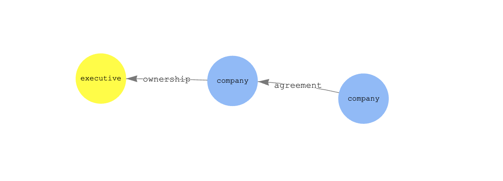

# GenAI and knowledge graphs

A graph database is a good data store to hold complex relationships. It's proven useful for social graphs, knowledge graphs, and other scenarios.

There are three ways we can look at knowledge graphs in the context of GenAI.

* Populating the graph. If you have a large set of unstructured data like news articles, business documents, and meeting notes, it could be difficult to extract the nodes and edges.
* Using natural language to query the graph. Once a graph is built, you can use an LLM to make it easier to ask questions of the graph, without learning graph query languages like Cypher or Sparql.
* GraphRAG. This is a technique that pulls information from the graph to include in the context for a RAG application.

## Building a knowledge graph with an LLM

We have two options to build a knowledge graph.

### Option 1 - DIY with Bedrock and Neptune

The notebook `kg.ipynb` shows how to use Anthropic Claude to extract nodes and edges from a set of news articles, and insert them into Neptune. To try this approach:

* Create a Neptune serverless cluster
* Create a Neptune notebook instance for the cluster
* Give Neptune notebook instance permission to access Bedrock 
* Upload notebook `kb.ipynb` to the notebook instance 
* Execute the notebook. 

It's possible that Claude may end up duplicating nodes, relationships, and node labels (entity types). Duplicate nodes are not a problem as we can use the `MERGE` command in OpenCypher, which does an upsert. If duplicate labels are a concern, we can maintain a list of existing node and edge types and give them to Claude to consider before responding.

### Option 2 - LlamaIndex

LlamaIndex has a [Knowledge Index](https://docs.llamaindex.ai/en/stable/examples/index_structs/knowledge_graph/KnowledgeGraphDemo.html#). We will use Neo4j Community Edition as our graph store, as LlamaIndex does not yet support Neptune.

To try this approach:

* Install [Neo4j](https://aws.amazon.com/marketplace/pp/prodview-lxxbmpqvwo5eq?sr=0-2&ref_=beagle&applicationId=AWSMPContessa#pdp-pricing) in your AWS account.
* Upload the notebook `kg-graph-rag.ipynb` to a Jupyter instance.
* Execute the notebook.

## Querying the graph with natural language

### Option 1 - Langchain

Another interesting area is using an [OpenCypher chain](https://api.python.langchain.com/en/latest/chains/langchain.chains.graph_qa.neptune_cypher.NeptuneOpenCypherQAChain.html#langchain.chains.graph_qa.neptune_cypher.NeptuneOpenCypherQAChain) to generate Cypher queries based on plain text. That will help less technical users make use of the knowledge graph, as graph database syntax is unfamiliar to many users.

The notebook `kg.ipynb` includes an example using this chain.

### Option 2 - LlamaIndex

We have not yet implemented this, but LlamaIndex does support running retrieval off of a graph.

## GraphRAG

### Option 1 - DIY

The notebook `kg.ipynb` shows how to implement a simple GraphRAG approach. Based on a query, it uses Claude to identify the key concepts in the query. It then tries to find these concepts in the graph and provide a subgraph as context to Claude for the final answer.

### Option 2 - LlamaIndex

We haven't tried this, but LlamaIndex has its own [GraphRag](https://docs.llamaindex.ai/en/stable/examples/query_engine/knowledge_graph_rag_query_engine.html) system.

### Option 3 - Langchain

There is no convenient way to perform GraphRAG in langchain, although this [blog](https://blog.langchain.dev/using-a-knowledge-graph-to-implement-a-devops-rag-application/) shows how to use both direct query as well as embedding extraction to help.

### Option 4 - DIY with embeddings

The notebook `kg-embed.ipynb` shows how to build the knowledge graph with embeddings and use those to direct the subgraph search. In order to use this:

* Create a Neptune Analytics graph with an embedding dimension of 1,536
* Create a Neptune Analytics notebook [using CloudFormation](https://docs.aws.amazon.com/neptune-analytics/latest/userguide/create-notebook-cfn.html)
* Give the notebook permission to invoke Bedrock models (Claude and Titan embeddings)
* Upload the notebook and execute it

## Security

See [CONTRIBUTING](CONTRIBUTING.md#security-issue-notifications) for more information.

## License

This library is licensed under the MIT-0 License. See the LICENSE file.

